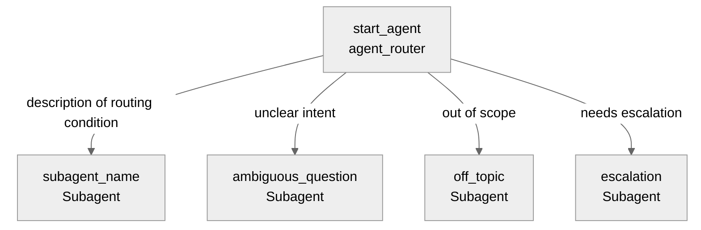

# Agent Spec: Agent_API_Name

## Purpose & Scope

Describe the agent's purpose in 1-2 sentences. What does it help users do?
What domain does it operate in?

## Behavioral Intent

Describe the key behavioral rules that govern the agent:
- What must the agent know before taking action?
- What action implementation types are used (Apex, Flow, Prompt Template)?
- What guardrails apply (off-topic handling, escalation)?
- What information persists across subagent switches?

## Subagent Posture

For each subagent, specify posture and why:

| Subagent | Posture (scripted/mixed/agentic) | Why this posture? | Deterministic controls (if any) |
|----------|-----------------------------------|-------------------|-----------------------------------|
| agent_router | mixed | default router behavior | transition invariants only |
| example_subagent | agentic | open-ended assistance | none |

Use [references/posture-and-determinism.md](../references/posture-and-determinism.md) for posture rules.

## Subagent Map

Expand the diagram to show actions, deterministic controls (when needed), and variable state changes
within each subagent. See the Subagent Map Diagrams reference for conventions.

## Variables

- `variable_name` (mutable type = default) — What this variable tracks.
  Set by: which action or utility. Read by: which subagents for gating or
  conditional instructions.

## Actions

### action_name (subagent_name subagent)

- **Target:** `apex://ClassName` or `flow://FlowName` or `prompt://PromptTemplateName`
- **Status:** EXISTS / NEEDS STUB / NEEDS CREATION

#### Inputs

| Name | Type | Required | Source |
|------|------|----------|--------|
| property_id | string | Yes | User input |
| max_results | integer | No | Defaults to 10 |

#### Outputs

| Name | Type | Visible to User? | Source | Notes |
|------|------|-------------------|--------|-------|
| property | object | Yes | `Property__c` | Complete property details |
| related_applications | list[object] | Yes | `Application__c` | Records for this property |
| active_listing | boolean | Yes | `Listing__c` | Listing status |
| hasData | boolean | No | Computed | Internal empty-result flag |

> **"Visible to User?"** maps to `filter_from_agent` in the `.agent` file: Yes → `filter_from_agent: False`, No → `filter_from_agent: True`.

#### Stubbing Requirement

If NEEDS STUB:

- Apex class name and inner class wrappers needed
- `complex_data_type_name` for each `object`/`list[object]` output
- Key queries or computation logic the stub must implement

Repeat for each action.

## Action Invocation Strategy

For each action, decide how it gets invoked:

| Action | Subagent | Invocation Mode | Why |
|--------|----------|-----------------|-----|
| action_name | subagent_name | `run` / planner slot-fill / `setVariables` | Rationale |

**Modes:**
- **`run @actions.X` in `instructions: ->`** — Deterministic. Fires every time the condition holds. Use for mandatory steps (verification checks, post-action logging).
- **Planner slot-fill (`with param = ...` in `reasoning.actions:`)** — LLM decides when to invoke. Use for user-initiated actions where the LLM should judge intent.
- **`@utils.setVariables`** — LLM captures values and ends the turn. Use only for pure data collection where no immediate follow-up action is needed in the same turn.

## Deterministic Controls (When Needed)

- `action_name` visibility: `available when @variables.variable_name != ""`
  — Rationale for why this gate exists.

Include only controls required by trust, policy, regulation, or observed failures.

## Architecture Pattern

Default to router-first architecture. Note any deliberate exceptions.
State any workflow-local linear flows inside specific subagents.
Describe the routing strategy and how subagents relate to each other.

## Agent Configuration

- **developer_name:** `Agent_API_Name`
- **agent_label:** `Agent Display Name`
- **agent_type:** `AgentforceEmployeeAgent` or `AgentforceServiceAgent` — state the reasoning based on prompt signals (e.g., "accessible by employees" → Employee, "customer-facing channel" → Service)
- **default_agent_user:** Required for `AgentforceServiceAgent`. Forbidden for `AgentforceEmployeeAgent`. If specified, MUST be **user name**. MUST NEVER be **user ID**. User MUST have `Einstein Agent` license.
