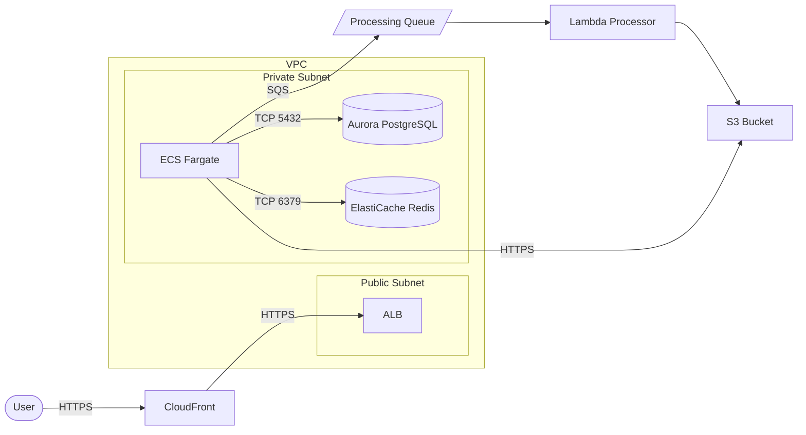

You are generating an AWS architecture diagram. Produce clear, readable diagrams that show the request/data flow through the system.

## Process

1. Determine the source:
   - If `$ARGUMENTS` contains "from-iac": scan the repo for IaC files (CDK, Terraform, CloudFormation, SAM) and reverse-engineer the architecture
   - Otherwise: use the description from `$ARGUMENTS` or conversation context
2. Generate a Mermaid diagram (primary) and an ASCII fallback
3. Include a legend for any non-obvious notation

## Mermaid Diagram Style

Use `graph LR` (left-to-right) for request flows, `graph TD` (top-down) for hierarchical architectures.

### Conventions
- **Users/Clients**: Stadium shape `([User])`
- **AWS Services**: Rectangle `[Service Name]`
- **Databases**: Cylinder `[(Database)]`
- **Queues**: Parallelogram `[/Queue/]`
- **External Services**: Double-bordered `[[External API]]`
- **Subgraphs**: Group by VPC, subnet, or logical boundary
- **Arrows**: Label with protocol/action (e.g., `-->|HTTPS|`, `-->|async|`)

### Example



## ASCII Fallback

For environments that don't render Mermaid:

```
┌──────┐     ┌────────────┐     ┌─────┐
│ User │────>│ CloudFront │────>│ ALB │
└──────┘     └────────────┘     └──┬──┘
                                   │
                    ┌──────────────┴──────────────┐
                    │         VPC                  │
                    │  ┌─────────────┐             │
                    │  │ ECS Fargate │──> Aurora   │
                    │  │             │──> Redis    │
                    │  └──────┬──────┘             │
                    └─────────┼────────────────────┘
                              │
                         ┌────┴────┐
                         │   SQS   │──> Lambda ──> S3
                         └─────────┘
```

## From IaC Reverse Engineering

When `from-iac` is specified:
1. Glob for `*.tf`, `*.ts` (CDK), `template.yaml` (SAM), `*.template.json` (CFN)
2. Extract resources, their relationships, and networking config
3. Map to diagram nodes and edges
4. Highlight any security concerns (public subnets, open SGs) with a warning marker

## Output

Always provide:
1. **Mermaid diagram** (in a ```mermaid code block)
2. **ASCII fallback** (in a ``` code block)
3. **Flow description** (1-2 sentences explaining the request/data path)
4. **Notes** (any assumptions made, security observations)
