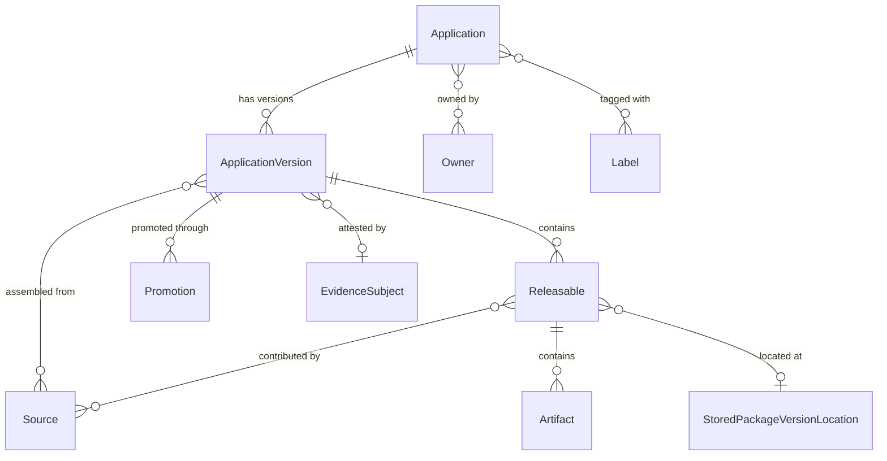

# AppTrust entities

When to read this file:

- Working with **applications**, **application versions**, or **releasables**.
- Querying or managing **application version promotions** through stages.
- Understanding what **sources** (builds, release bundles, other app versions) feed into an application version.
- Using the OneModel GraphQL API with the `applications` query root.

AppTrust entities are accessed exclusively via the **OneModel GraphQL API**
(`/onemodel/api/v1/graphql`). There are no CLI commands for this domain.

For the OneModel query workflow (credentials, schema fetch, validation,
execution), read `references/onemodel-graphql.md`.

## Entity relationship overview

## Application

The top-level entity representing a software application registered in
AppTrust. Applications belong to a JFrog Project and serve as the
organizational container for tracking versions, ownership, and criticality.

| Field | Description |
|-------|-------------|
| `key` | Unique identifier (referenced as `applicationKey` or `appKey` elsewhere) |
| `projectKey` | JFrog Project this application belongs to |
| `displayName` | Human-readable name |
| `criticality` | `unspecified`, `low`, `medium`, `high`, `critical` |
| `maturityLevel` | `unspecified`, `experimental`, `production`, `end_of_life` |
| `owners` | List of users or groups that own the application |
| `labels` | Key-value pairs for custom categorization |

Query: `applications.getApplication(key: "...")` or
`applications.searchApplications(where: {...})`.

## Application version

A versioned instance of an application. Each version captures a specific set
of releasable artifacts, their sources, and a promotion history through
lifecycle stages.

| Field | Description |
|-------|-------------|
| `application` | Parent application |
| `version` | Version identifier (semantic or custom) |
| `tag` | Optional tag |
| `status` | Processing status: `STARTED`, `FAILED`, `COMPLETED`, `DELETING` |
| `releaseStatus` | Release maturity: `PRE_RELEASE`, `RELEASED`, `TRUSTED_RELEASE` |
| `currentStageName` | Most recent stage the version has been promoted to (null if never promoted) |
| `createdBy`, `createdAt` | Audit fields |
| `evidenceSubject` | Evidence attestation anchor (shared across domains) |

The `releaseStatus` field is distinct from `status`: `status` tracks the
version creation process, while `releaseStatus` tracks its release maturity.

Query: `applications.getApplicationVersion(applicationKey: "...", version: "...")`
or `applications.searchApplicationVersions(where: {...})`.

## Releasable

A deployable unit within an application version — either a **package version**
or an individual **artifact**.

| Field | Description |
|-------|-------------|
| `name` | Package name or artifact file name |
| `version` | Package version (empty for non-package artifacts) |
| `packageType` | Repository package type (docker, maven, generic, etc.) |
| `releasableType` | `artifact` or `package_version` |
| `sha256` | Leading file checksum (e.g. manifest for Docker images) |
| `totalSize` | Sum of all artifact sizes in bytes |
| `sources` | Sources that contributed to this releasable |
| `artifacts` | Individual files that make up the releasable |
| `packageVersionLocation` | Link to `StoredPackageVersionLocation` for package releasables |
| `vcsCommit` | VCS commit details (for AppTrust-bound package versions) |

Releasables bridge the application model to the underlying Artifactory
storage. The `packageVersionLocation` field connects to the Stored Packages
domain (see `stored-packages-entities.md`).

## Application version promotion

Records the promotion of an application version from one stage to another.
All promotions are recorded including failed attempts.

| Field | Description |
|-------|-------------|
| `sourceStageName` | Stage being promoted from (empty for first promotion) |
| `targetStageName` | Stage being promoted to |
| `status` | `SUBMITTED`, `STARTED`, `PENDING`, `COMPLETED`, `FAILED`, `REJECTED` |
| `createdBy`, `createdAt` | Who initiated and when |
| `artifacts` | Artifacts included in this promotion (repo + path) |
| `messages` | Error messages if the promotion failed |

Promotions use the same environment/stage model as Release Bundle promotions
(see `release-lifecycle-entities.md`) but at the application level.

## Sources

Sources describe how releasables were assembled into an application version.
Four types exist:

| Source type | Fields | Description |
|-------------|--------|-------------|
| **Build** | `name`, `number`, `startedAt`, `repositoryKey` | A CI/CD build that produced releasables |
| **ReleaseBundle** | `name`, `version` | A release bundle whose artifacts were included |
| **ApplicationVersion** | `applicationKey`, `version` | Another application version (composition) |
| **Direct** | (none) | Directly included without an associated build or bundle |

Sources appear at both the application version level (all sources) and the
individual releasable level (sources for that specific releasable).

## Artifacts (within application versions)

Individual files within releasables.

| Field | Description |
|-------|-------------|
| `filePath` | Path in the repository (excluding repo key) |
| `downloadPath` | Full path for downloading from a Release Bundle repository |
| `sha256` | Checksum |
| `size` | Size in bytes |
| `evidenceSubject` | Evidence attestation anchor |

## Cross-domain connections

AppTrust entities connect to other domains via the OneModel GraphQL API:

- **Evidence** — `ApplicationVersion.evidenceSubject` and
  `ApplicationVersionArtifact.evidenceSubject` link to the Evidence domain
  via `EvidenceSubject.fullPath`. This allows querying evidence attached to
  app versions and their artifacts.
- **Stored Packages** — `Releasable.packageVersionLocation` links to
  `StoredPackageVersionLocation`, connecting the application model to where
  packages physically reside in Artifactory.
- **Release Bundles** — source type `ReleaseBundle` references release bundle
  name/version from the Release Lifecycle domain.
- **Builds** — source type `Build` references build-info records from
  Artifactory.
