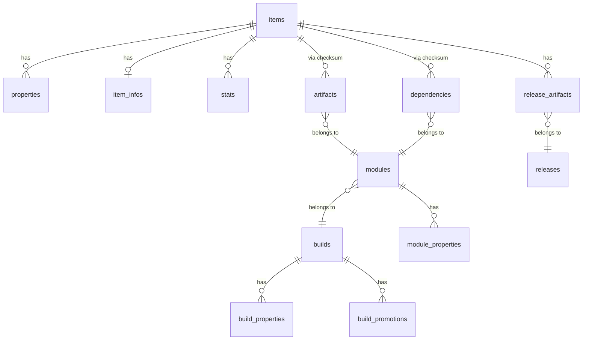

# AQL (Artifactory Query Language)

AQL queries are sent as POST requests with `Content-Type: text/plain`:

```bash
jf rt curl -XPOST /api/search/aql -H "Content-Type: text/plain" -d '<query>'
```

## Query structure

```
<domain>.find(<criteria>)
  .include(<fields>)
  .sort(<sort>)
  .offset(<n>)
  .limit(<n>)
  .distinct(<boolean>)
```

Only `.find()` is required. The others are optional and chainable.
**The chain order above is enforced by the server.** `.include()` must come
before `.sort()`, `.sort()` before `.offset()`, etc. Putting them out of
order (e.g. `.sort()` before `.include()`) produces a parse error.

**Mandatory include fields:** `items` requires `"repo","path","name"`;
`builds` requires `"name","number","repo"`. Always include these even when
you only need a subset — narrow results with `jq` post-query instead:

```
items.find({"name":"commons-lang3-3.12.0.jar"})
  .include("repo","path","name")
  .distinct(true)
```

## Domains

AQL has 13 queryable domains. Each domain represents a different entity type
and has its own set of fields.


| Domain               | Query name          | Description                                    |
| -------------------- | ------------------- | ---------------------------------------------- |
| Items                | `items`             | Artifacts stored in repositories (most common) |
| Properties           | `properties`        | Key-value properties on items                  |
| Item infos           | `item.infos`        | Property modification metadata                 |
| Statistics           | `stats`             | Download statistics (local and remote)         |
| Builds               | `builds`            | Build info records                             |
| Build modules        | `modules`           | Modules within a build                         |
| Build artifacts      | `artifacts`         | Artifacts produced by a build module           |
| Build dependencies   | `dependencies`      | Dependencies consumed by a build module        |
| Build properties     | `build.properties`  | Key-value properties on builds                 |
| Build promotions     | `build.promotions`  | Build promotion records                        |
| Module properties    | `module.properties` | Key-value properties on build modules          |
| Release bundles      | `releases`          | Release bundle records                         |
| Release bundle files | `release_artifacts` | Files within a release bundle                  |


## Domain relationships

Domains connect through the following join paths. Cross-domain queries
traverse these links — fields from related domains can appear in criteria
and include clauses by prefixing the domain path.




**Key:** Items connect to build artifacts and dependencies through SHA-1
checksum matching, not a direct key. This means a cross-domain query from
items to builds traverses: items → artifacts → modules → builds.

### Cross-domain field paths

To reference a field from a related domain, use dot-separated domain paths:

```
items.find({"artifact.module.build.name":"my-build"})
  .include("name","repo","path","artifact.module.build.number")
```

Common cross-domain paths from items:

- `stat.downloads`, `stat.downloaded` — download statistics
- `property.key`, `property.value` — item properties
- `artifact.module.build.name` — build that produced the item
- `artifact.module.build.number` — build number

From builds:

- `module.artifact.name` — artifacts in build modules
- `module.dependency.name` — dependencies of build modules

## Fields by domain

Field types: `string`, `date`, `int`, `long`, `itemType` (`file`, `folder`,
or `any`). Fields marked "default" are returned without explicit `.include()`.

### items


| Field           | Type     | Default |
| --------------- | -------- | ------- |
| `repo`          | string   | yes     |
| `path`          | string   | yes     |
| `name`          | string   | yes     |
| `type`          | itemType | yes     |
| `size`          | long     | yes     |
| `depth`         | int      | yes     |
| `created`       | date     | yes     |
| `created_by`    | string   | yes     |
| `modified`      | date     | yes     |
| `modified_by`   | string   | yes     |
| `updated`       | date     | yes     |
| `actual_md5`    | string   | no      |
| `actual_sha1`   | string   | no      |
| `sha256`        | string   | no      |
| `original_md5`  | string   | no      |
| `original_sha1` | string   | no      |


Computed field: `virtual_repos` — returns virtual repositories that include
the item's actual repository. Must use `.include("virtual_repos")` explicitly;
requires `repo`, `path`, `name` in the result set.

### properties


| Field   | Type   | Default |
| ------- | ------ | ------- |
| `key`   | string | yes     |
| `value` | string | yes     |


### stats


| Field                  | Type   | Default |
| ---------------------- | ------ | ------- |
| `downloads`            | int    | yes     |
| `downloaded`           | date   | yes     |
| `downloaded_by`        | string | yes     |
| `remote_downloads`     | int    | yes     |
| `remote_downloaded`    | date   | yes     |
| `remote_downloaded_by` | string | yes     |
| `remote_origin`        | string | yes     |
| `remote_path`          | string | yes     |


### item.infos


| Field               | Type   | Default |
| ------------------- | ------ | ------- |
| `props_modified`    | date   | yes     |
| `props_modified_by` | string | yes     |
| `props_md5`         | string | yes     |


### builds


| Field         | Type   | Default |
| ------------- | ------ | ------- |
| `url`         | string | yes     |
| `name`        | string | yes     |
| `number`      | string | yes     |
| `started`     | date   | yes     |
| `created`     | date   | yes     |
| `created_by`  | string | yes     |
| `modified`    | date   | yes     |
| `modified_by` | string | yes     |
| `repo`        | string | no      |


### modules


| Field  | Type   | Default |
| ------ | ------ | ------- |
| `name` | string | yes     |


### artifacts


| Field  | Type   | Default |
| ------ | ------ | ------- |
| `name` | string | yes     |
| `type` | string | yes     |
| `sha1` | string | yes     |
| `md5`  | string | yes     |


### dependencies


| Field   | Type   | Default |
| ------- | ------ | ------- |
| `name`  | string | yes     |
| `scope` | string | yes     |
| `type`  | string | yes     |
| `sha1`  | string | yes     |
| `md5`   | string | yes     |


### build.properties


| Field   | Type   | Default |
| ------- | ------ | ------- |
| `key`   | string | yes     |
| `value` | string | yes     |


### build.promotions


| Field        | Type   | Default |
| ------------ | ------ | ------- |
| `created`    | date   | yes     |
| `created_by` | string | yes     |
| `status`     | string | yes     |
| `repo`       | string | yes     |
| `comment`    | string | yes     |
| `user`       | string | yes     |


### module.properties


| Field   | Type   | Default |
| ------- | ------ | ------- |
| `key`   | string | yes     |
| `value` | string | yes     |


### releases


| Field          | Type                        | Default |
| -------------- | --------------------------- | ------- |
| `name`         | string                      | yes     |
| `version`      | string                      | yes     |
| `status`       | string                      | yes     |
| `created`      | date                        | yes     |
| `signature`    | string                      | yes     |
| `type`         | string (`SOURCE`, `TARGET`) | yes     |
| `storing_repo` | string                      | yes     |


### release_artifacts


| Field  | Type   | Default |
| ------ | ------ | ------- |
| `path` | string | yes     |


## Comparators


| Operator   | Meaning                          | Example                              |
| ---------- | -------------------------------- | ------------------------------------ |
| `$eq`      | Equals (default if omitted)      | `{"type":"file"}`                    |
| `$ne`      | Not equals                       | `{"type":{"$ne":"folder"}}`          |
| `$eqic`    | Equals, case-insensitive         | `{"name":{"$eqic":"README.md"}}`     |
| `$match`   | Wildcard match (`*`, `?`)        | `{"name":{"$match":"*.jar"}}`        |
| `$matchic` | Wildcard match, case-insensitive | `{"name":{"$matchic":"*.JAR"}}`      |
| `$nmatch`  | Wildcard not-match               | `{"name":{"$nmatch":"*-SNAPSHOT*"}}` |
| `$gt`      | Greater than                     | `{"size":{"$gt":"1000000"}}`         |
| `$gte`     | Greater than or equal            | `{"stat.downloads":{"$gte":"10"}}`   |
| `$lt`      | Less than                        | `{"size":{"$lt":"5000"}}`            |
| `$lte`     | Less than or equal               | `{"modified":{"$lte":"2025-01-01"}}` |


### Boolean operators


| Operator | Description                                                            |
| -------- | ---------------------------------------------------------------------- |
| `$and`   | All conditions must match (implicit when fields are at the same level) |
| `$or`    | Any condition must match                                               |


```
items.find({"$and":[
  {"repo":"my-repo"},
  {"$or":[
    {"name":{"$match":"*.jar"}},
    {"name":{"$match":"*.war"}}
  ]}
]})
```

### Relative date comparators

AQL supports relative date queries with `$last` and `$before`:


| Operator  | Meaning                                                 | Example                         |
| --------- | ------------------------------------------------------- | ------------------------------- |
| `$last`   | Within the last N period (equivalent to `$gt` from now) | `{"modified":{"$last":"7d"}}`   |
| `$before` | Before the last N period (equivalent to `$lt` from now) | `{"created":{"$before":"3mo"}}` |


Supported units: `d` (days), `w` (weeks), `mo` (months), `y` (years),
`s` (seconds), `mi` (minutes), `ms` (milliseconds).

### Multi-property AND

To match items that have property A=1 **and** property B=2 (different
property rows), use `$and` with `@` shorthand:

```
items.find({"$and":[
  {"@build.name":"my-build"},
  {"@build.number":"42"}
]})
```

AQL also documents a `$msp` (multi-set property) operator for this purpose,
but `$msp` is **unreliable in practice** — it returns 0 results on many
server versions even when matching items exist. Prefer `$and` with `@`
shorthand, which is verified to work correctly.

## Date queries

Dates use ISO 8601 format for absolute dates:

```
items.find({"modified":{"$gt":"2025-06-01T00:00:00.000Z"}})
```

Or use relative dates (preferred — avoids hardcoding timestamps):

```
items.find({"modified":{"$last":"30d"}})
items.find({"created":{"$before":"6mo"}})
```

## Property queries

Two equivalent syntaxes for property filtering:

**`@key` shorthand** — concise, works for single property conditions:

```
items.find({"repo":"my-repo","@build.name":"my-build","type":"file"})
```

**Explicit form** — `property.key`/`property.value` pairs:

```
items.find({
  "repo":"my-repo",
  "property.key":"build.name",
  "property.value":"my-build"
})
```

**Multi-property AND** — use `$and` with `@` shorthand to match across
different property rows:

```
items.find({"$and":[
  {"@build.name":"my-build"},
  {"@build.number":"42"}
]})
```

> **Note:** The `@key` shorthand works inside `$and`. For `$or`, use the
> explicit `property.key`/`property.value` form if the shorthand does not
> return expected results.

## Include

Select which fields to return. Without `.include()`, AQL returns each
domain's default field set.

**When you use `.include()`, you replace the defaults — so you must
explicitly list any required fields:**

- `items` domain: always include `"repo","path","name"` (server rejects
the query otherwise)
- `builds` domain: always include `"name","number","repo"`

```
items.find({"repo":"my-repo"})
  .include("name","repo","path","size","sha256","stat.downloads")
```

Cross-domain includes use dot-separated paths:

```
items.find({"repo":"my-repo"})
  .include("name","repo","path","property.key","property.value")
```

## Sort and pagination

```
items.find({"repo":"my-repo"})
  .sort({"$desc":["modified"]})
  .offset(0)
  .limit(50)
```

Sort directions: `$asc`, `$desc`. Sort fields must also appear in the result
set (explicit `.include()` or default fields). See
[Before constructing a query](#before-constructing-a-query) for sort
performance rules.

## Distinct

Deduplicate result rows:

```
items.find({"repo":"my-repo"}).distinct(true)
```

## Validation rules

The server enforces these constraints — violating them produces an error:

**Non-admin users:**

- `items` domain queries must include `repo`, `path`, `name` in results
(needed for permission filtering)
- `builds` domain queries must include `name`, `number`, `repo` in results

**Transitive mode** (`.transitive()` for querying through virtual repos):

- Only works with `items` domain
- Include subdomains limited to `items` and `properties`
- Repo criteria must use `$eq` (exact match) with a single repository
- No `offset` or `sort` allowed

## Before constructing a query

Run through these checks before writing any AQL query:

1. **Never `.sort()` without a `repo` filter** — forces a full table scan
   across all repositories. Sort client-side with `jq` instead. Also,
   `.sort()` on cross-domain fields (e.g. `stat.downloads` in `items.find()`)
   is silently ignored — fetch all rows and sort client-side.
2. **Always set `.limit()`** — no built-in default limit; unbounded queries
   can time out or OOM. Broad queries without a `repo` filter are especially
   expensive.
3. **`range.total` = returned count, not total matching** — AQL has no
   count-only mode. To find the true total, paginate with `.offset()` until
   a page returns fewer results than the limit.
4. **AQL has no repo-type field** — to restrict to local repos, either
   pre-query `GET /api/repositories?type=local` and add repo names to
   criteria (practical when count is small), or query without a repo filter
   and exclude `-cache` / `-virtual` suffixed repos client-side with `jq`.
5. **Narrow server-side first** — add every applicable filter (`created_by`,
   `created`, `type`, `name`) before relying on client-side `jq` filtering.

## Common query patterns

### Find all JARs in a repo

```
items.find({"repo":"libs-release","name":{"$match":"*.jar"}})
```

### Find large files (> 100 MB)

```
items.find({"repo":"my-repo","size":{"$gt":"104857600"},"type":"file"})
```

### Find Maven SNAPSHOT JARs

Use `*-SNAPSHOT*.jar` (not `*-SNAPSHOT.jar`) to also match classifier
artifacts like `-sources.jar` and `-javadoc.jar`:

```
items.find({"repo":"libs-snapshot","name":{"$match":"*-SNAPSHOT*.jar"},"type":"file"})
```

### Find artifacts modified in the last 7 days

```
items.find({"repo":"my-repo","modified":{"$last":"7d"},"type":"file"})
  .sort({"$desc":["modified"]})
  .limit(100)
```

### Docker queries

Use `"name":"manifest.json"` to **list tags** (one per tag). Use
`"name":{"$match":"*manifest.json"}` to **query all manifests** (includes
`list.manifest.json` for multi-arch tags — see [Gotchas](#gotchas)).

```
items.find({"repo":"docker-local","path":{"$match":"my-image/*"},"name":"manifest.json"})
```

### Docker image size

**Do not use AQL** — layer blobs live at `<image>/sha256:<digest>/`, not
under `<image>/<tag>/`. Use the V2 manifest API (returns `layers[].size`):

```bash
jf rt curl -s -XGET "/api/docker/<repo>/v2/<image>/manifests/<tag>" \
  -H "Accept: application/vnd.docker.distribution.manifest.v2+json"
```

For multi-arch images the response is an image index; fetch each platform
manifest by digest to get its layers.

### Find artifacts with a specific property

```
items.find({"repo":"my-repo","@build.name":"my-build","type":"file"})
```

### Find never-downloaded files (zero download count)

Zero-download items lack a stats row — filter client-side instead
(see [Gotchas](#gotchas)):

```bash
jf rt curl -s -XPOST /api/search/aql -H "Content-Type: text/plain" -d '
items.find({"repo":"my-repo","type":"file"})
  .include("repo","path","name","size","stat.downloads")
' | jq '[.results[] | select((.stats[0].downloads // 0) == 0) | {repo, path, name, size}]'
```

### Find artifacts not downloaded in 90 days

Only matches previously-downloaded items (see [Gotchas](#gotchas)).
Combine with the never-downloaded pattern above for full coverage.

```
items.find({
  "repo":"my-repo",
  "type":"file",
  "stat.downloaded":{"$before":"90d"}
}).include("name","repo","path","stat.downloaded","size")
```

### Find items by build name (cross-domain)

```
items.find({"artifact.module.build.name":"my-service"})
  .include("name","repo","path","artifact.module.build.number")
  .sort({"$desc":["modified"]})
  .limit(50)
```

### Find builds by name

Non-admin users must include `name`, `number`, `repo` — omitting any
produces an error.

```
builds.find({"name":{"$match":"*my-service*"}})
  .include("name","number","repo","started")
  .sort({"$desc":["started"]})
  .limit(10)
```

### Find build artifacts

```
artifacts.find({"module.build.name":"my-service","module.build.number":"42"})
  .include("name","type","sha1","md5")
```

### Find build dependencies

```
dependencies.find({"module.build.name":"my-service","module.build.number":"42"})
  .include("name","scope","type","sha1")
```

### Remote repository content

Remote repo artifacts are stored in a `-cache` suffixed repo. Always query
the cache repo, not the remote repo itself:

```
items.find({"repo":"npm-remote-cache","name":{"$match":"*.tgz"}})
```

## Gotchas

- The request body is **plain text**, not JSON — use
`Content-Type: text/plain`.
- String values in criteria must be quoted, including numeric comparisons
(`"size":{"$gt":"1000"}` not `"size":{"$gt":1000}`).
- Remote repo content lives in `<repo>-cache`, not `<repo>`.
- Sort fields must appear in the result set (included explicitly or by
default).
- Non-admin `items` queries must return `repo`, `path`, `name`.
- Non-admin `builds` queries must return `name`, `number`, `repo`.
- Items connect to builds through checksum matching (SHA-1), so cross-domain
queries between items and builds are valid but traverse multiple joins.
- The `path` value for items at the **root** of a repository is `"."`, not
`""` or `"/"`. Use `"path":"."` to match root-level files.
- **Docker `list.manifest.json`** — multi-arch images store two manifest files per
  tag: `manifest.json` (platform-specific manifest) and `list.manifest.json` (OCI
  image index). Filtering by `"name":"manifest.json"` is correct for tag listing
  (one result per tag), but silently excludes `list.manifest.json` entries. Use
  `"name":{"$match":"*manifest.json"}` when querying by uploader, date range, or
  any context where all manifest pushes should be counted.
- **`stat.downloads` filters do not match zero-download items** — never-downloaded
  items lack a stats row so the join finds nothing. Use the client-side `jq`
  approach in "Find never-downloaded files" above.
- `$match` uses SQL-style wildcards: `*` matches any characters, `?` matches
exactly one character. It is **not** regex. Literal `_` and `%` in patterns
are escaped automatically.
- The `builds.number` field is a **string**, not an integer. Build numbers
like `"42"`, `"1.0.3"`, and `"SNAPSHOT-1"` are all valid.
- Release bundle `type` values are uppercase strings: `"SOURCE"` or
`"TARGET"`.
- Dates accept both ISO 8601 format (`"2025-06-01T00:00:00.000Z"`) and
epoch milliseconds as a string (`"1719792000000"`).
- The server silently excludes trash, support-bundle, and in-transit
repository content from AQL results. If an item exists but doesn't appear
in results, it may be in one of these hidden repos.
- Virtual repo queries are rewritten to search the underlying physical repos.
The `repo` field in results shows the physical repo name, not the virtual
repo name you queried.

## Official documentation

- [Artifactory Query Language](https://docs.jfrog.com/artifactory/docs/artifactory-query-language) — overview and architecture
- [Query Structure and Syntax](https://docs.jfrog.com/artifactory/docs/aql-syntax) — domain queries, field references, JSON-like syntax rules
- [Search Criteria and Operators](https://docs.jfrog.com/artifactory/docs/aql-search-criteria) — comparators, wildcards, `$msp`, relative time
- [AQL Entities and Fields Reference](https://docs.jfrog.com/artifactory/docs/aql-entities-fields-reference) — complete field list for all domains
- [Query Output and Modifiers](https://docs.jfrog.com/artifactory/docs/aql-query-output) — `.include()`, `.sort()`, `.offset()`, `.limit()`, `.distinct()`
- [Query Execution and Permissions](https://docs.jfrog.com/artifactory/docs/aql-query-execution) — authentication, scoped tokens, HTTP errors, streaming
- [AQL Examples and Common Patterns](https://docs.jfrog.com/artifactory/docs/aql-examples) — ready-to-use queries by use case
- [Repository-Specific Queries](https://docs.jfrog.com/artifactory/docs/aql-repository-queries) — `.transitive()`, virtual repos, remote search
- [Performance and Operational Controls](https://docs.jfrog.com/artifactory/docs/aql-performance) — result limits, timeouts, rate limiting, optimization

