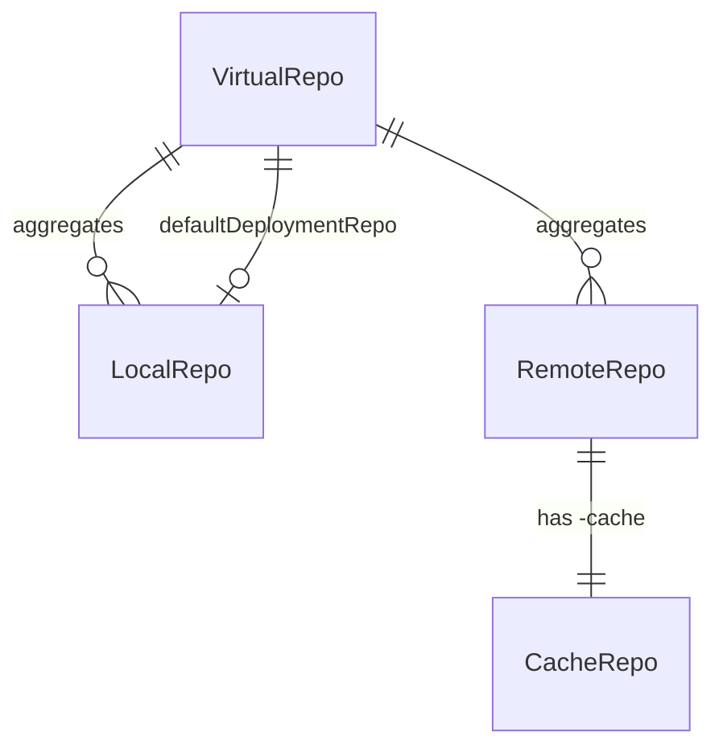

# Artifactory entities

When to read this file:

- Working with **repositories** and you need to understand the difference between local, remote, virtual, and federated types.
- Managing **artifacts**, **properties**, or **package types**.
- Working with **builds**, **build promotion**, or **permission targets**.
- Debugging unexpected behavior related to repo types (e.g. upload failures, missing search results).

For CLI commands see `artifactory-operations.md`. For API gaps see
`artifactory-api-gaps.md`. For AQL syntax see `artifactory-aql-syntax.md`.

## Repositories

A repository is the primary storage and resolution unit in Artifactory. Every
repo has a **key** (unique identifier), a **package type** (immutable after
creation), and a **repository class** (`rclass`) that determines its behavior.

### Repository types

| Type | `rclass` | Behavior | Stores artifacts? |
|------|----------|----------|-------------------|
| **Local** | `local` | Hosts artifacts deployed directly (upload, promote, copy, move) | Yes |
| **Remote** | `remote` | Proxies an external URL; downloads are cached in a companion `-cache` repo | Only in the `-cache` repo |
| **Virtual** | `virtual` | Aggregates multiple local and remote repos under a single URL for resolution | No (resolves from underlying repos) |
| **Federated** | `federated` | Local repo that bi-directionally synchronizes across Platform Deployments | Yes (replicated across sites) |

### Key relationships and fields

- `key` — unique repo identifier (e.g. `libs-release-local`)
- `packageType` — determines layout and protocol (see Package types below)
- `rclass` — `local`, `remote`, `virtual`, or `federated`
- `url` — (remote only) the external source URL being proxied
- `repositories` — (virtual only) ordered list of local/remote repos to aggregate
- `projectKey` — links repo to a JFrog Project (see `platform-access-entities.md`)
- `environments` — environments the repo is assigned to (used in RBAC and lifecycle)

### System repositories

Artifactory and Xray maintain several **system repositories** for internal
platform metadata. These are not user-created and should be excluded when
iterating over repositories for reporting, scanning, or auditing:

| Pattern | Purpose |
|---------|---------|
| `release-bundles` | Release Bundles V1 metadata |
| `release-bundles-v2` | Release Bundles V2 metadata |
| `artifactory-build-info` | Default build info storage |
| `*-release-bundles` | Project-scoped Release Bundles V1 |
| `*-release-bundles-v2` | Project-scoped Release Bundles V2 |
| `*-build-info` | Project-scoped build info storage |
| `*-application-versions` | AppTrust application version metadata |

Including these in aggregate queries (violation counts, storage reports, etc.)
produces misleading results because they contain platform metadata rather than
user artifacts.

### Remote repository cache

When Artifactory downloads an artifact through a remote repo, it stores the
cached copy in a **separate local repo** named `<remote-key>-cache`. This is
critical for:

- **AQL queries** — search the `-cache` repo, not the remote repo key
- **Properties** — properties on cached artifacts live on the `-cache` repo
- **Storage calculations** — cached artifacts consume storage under the `-cache` repo

The remote repo key itself is used for **configuration** (URL, credentials,
inclusion/exclusion patterns) but does not directly contain artifacts.

### Virtual repository resolution

A virtual repo aggregates **both local and remote repos** under a single URL.
It resolves artifacts by searching its underlying repos in the configured
**order** — when the same artifact exists in multiple underlying repos, the
first match wins.

A virtual repo may designate one of its underlying **local** repos as the
**default deployment repository**. Uploads through the virtual URL are routed
to that local repo. Without a default deployment repo, the virtual repo is
read-only.

## Artifacts

An artifact is a file stored in a repository. Each artifact is uniquely
identified by the triple **repo + path + name**.

Key attributes:
- `repo`, `path`, `name` — location identifier
- `size` — bytes
- `sha256`, `sha1`, `md5` — checksums (sha256 is the primary identifier for cross-referencing with builds and Xray)
- `created`, `modified`, `created_by`, `modified_by` — audit fields

Artifacts are **content-addressable** — build info and Xray reference them by
checksum, not by path. Moving or copying an artifact changes its path but not
its checksum, so build associations follow the artifact.

## Properties

Key-value metadata pairs attached to artifacts or folders.

- Keys are strings; values are strings or arrays of strings
- Set via `jf rt set-props`, queried via AQL or the properties API
- Commonly used for: build metadata, maturity labels, promotion tracking, cleanup policies
- Properties on remote-cached artifacts live on the `-cache` repo

## Package types

The `packageType` field on a repository determines how Artifactory interprets
its contents. It controls directory structure conventions, metadata extraction,
and which client protocols are supported (e.g. Docker registry API, npm
registry, Maven layout).

Common types: `maven`, `gradle`, `npm`, `docker`, `pypi`, `nuget`, `go`,
`helm`, `rpm`, `debian`, `generic`.

Package type is **immutable** — it cannot be changed after repo creation. Use
`generic` when no specific package type applies.

## Build info

A build info record captures CI/CD metadata: which artifacts were produced,
which dependencies were consumed, and the build environment.

| Field | Description |
|-------|-------------|
| `name` + `number` | Unique identifier for a build run |
| `modules` | List of modules, each with its own artifacts and dependencies |
| `vcs` | Version control metadata (revision, URL, branch) |
| `buildAgent`, `agent` | CI tool info |
| `properties` | Custom build-level properties |

Build info references artifacts **by checksum** (sha256). This means:
- A build can reference artifacts across multiple repositories
- Moving an artifact does not break the build association
- Xray scans build info by resolving checksums to components

Lifecycle: collect → publish → (optionally) promote → (optionally) scan.

## Build promotion

Promotion changes a build's **status** and can copy or move its artifacts
from a source repo to a target repo.

| Field | Description |
|-------|-------------|
| `status` | Target status label (e.g. `staged`, `released`) |
| `sourceRepo` | Where artifacts currently reside |
| `targetRepo` | Where artifacts should be moved/copied |
| `copy` | If `true`, copy instead of move |

Promotion records are queryable via AQL (`build.promotions` domain) and the
build promotion API.

## Permissions

Permissions define RBAC policies mapping **resources** and **principals**
(users and groups) to **actions**. Two models exist:

### Permissions V2 (Access Permissions) — current model

Managed by the **Access service** (since Artifactory 7.72.0, recommended from
7.77.2). Supports all resource types.

| Component | Description |
|-----------|-------------|
| `name` | Permission name |
| `resources` | Map of resource type → targets + actions |

Resource types: `artifact` (repositories), `build`, `release_bundle`,
`destination` (Edge nodes), `pipeline_source`.

Each resource contains:
- `targets` — map of target names/patterns to include/exclude patterns
- `actions.users` — map of username → list of actions
- `actions.groups` — map of group name → list of actions

Actions use uppercase: `READ`, `ANNOTATE`, `DEPLOY/CACHE`, `DELETE/OVERWRITE`,
`MANAGE_XRAY_METADATA`, `MANAGE`.

API: `POST/PUT/GET/DELETE /access/api/v2/permissions/{permissionName}`.

Documentation: [Permissions](https://docs.jfrog.com/administration/docs/permissions).

### Permission targets (V1) — legacy model

Managed by **Artifactory**. Still functional and backwards compatible, but
V2 is recommended for new implementations. The CLI `jf rt permission-target-*`
commands use this API.

| Component | Description |
|-----------|-------------|
| `repositories` | List of repo keys or patterns |
| `actions.users` | Map of username → list of actions |
| `actions.groups` | Map of group name → list of actions |

Actions use lowercase: `read`, `write`, `annotate`, `delete`, `manage`.

Does **not** support `destination` or `pipeline_source` resource types.

API: `PUT /artifactory/api/security/permissions/{permissionName}`.

### Key differences

| Aspect | V1 (Permission Targets) | V2 (Access Permissions) |
|--------|------------------------|------------------------|
| Managed by | Artifactory | Access service |
| API base | `/artifactory/api/security/permissions/` | `/access/api/v2/permissions/` |
| Actions | lowercase (`read`, `write`) | uppercase (`READ`, `WRITE`) |
| Resource types | repos, builds, release bundles | + destinations, pipeline sources |
| Pattern fields | `includes_pattern` / `excludes_pattern` | `include_patterns` / `exclude_patterns` |
| CLI support | `jf rt permission-target-*` | No direct CLI commands (use REST) |

For project-scoped RBAC, see Project roles in `platform-access-entities.md`.

## Replication

Replication synchronizes artifacts and properties between repositories, either
within the same instance or across Platform Deployments.

| Type | Direction | Trigger |
|------|-----------|---------|
| **Push** | Source pushes to target | Scheduled or event-based |
| **Pull** | Target pulls from source | Scheduled |

Replication configs are JSON templates applied per repository. Both artifact
content and properties are replicated. For federated repos, replication is
automatic and bi-directional across all member nodes.
