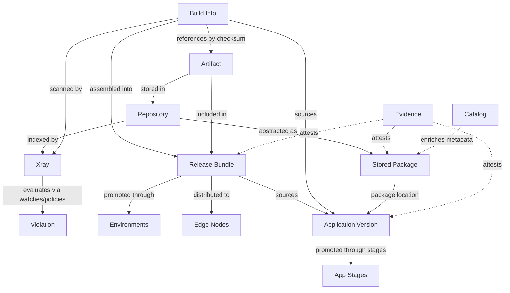

# JFrog entity index

When to read this file:

- The user mentions a JFrog entity and you need to identify which **domain** it belongs to.
- You are planning an operation that spans **multiple products** (e.g. build → scan → release).
- You need a quick **one-line definition** before deciding whether to load the full domain reference.
- You need **GraphQL (OneModel)** entry points (workflow, examples, patterns) —
  see [GraphQL (OneModel)](#graphql-onemodel) below.

After identifying the domain, follow the pointer in the **Reference** column for
detailed definitions, relationships, and agent rules.

## Cross-product flow

Key takeaway: **artifacts** are the atomic unit. Builds reference them,
Xray scans them, release bundles collect them, distribution delivers them.
**Applications** orchestrate the top-level release flow. **Stored Packages**
bridge artifacts to the package abstraction. **Catalog** enriches packages
with global security, legal, and operational metadata. **Evidence** attests
to entities across all domains.

## GraphQL (OneModel)

For the unified **OneModel GraphQL** API (cross-product list/search over
applications, packages, evidence, release bundles, catalog, and related
entities on the platform base URL):

- **Workflow** — mandatory per-server supergraph schema, validation, execution,
  errors: `onemodel-graphql.md`
- **Query templates and domain examples** — `onemodel-query-examples.md`
- **Pagination, variables, date formats** — `onemodel-common-patterns.md`

Also see **GraphQL (OneModel)** in the base `SKILL.md` (Tier 3 curl).

## Entity lookup

| Entity | Domain | Definition | Reference |
|--------|--------|------------|-----------|
| **Local repository** | Artifactory | Stores artifacts deployed directly (upload, promote, move) | `artifactory-entities.md` |
| **Remote repository** | Artifactory | Proxy/cache for an external source; cached artifacts live in its `-cache` repo | `artifactory-entities.md` |
| **Virtual repository** | Artifactory | Aggregates local and remote repos under a single resolution URL | `artifactory-entities.md` |
| **Federated repository** | Artifactory | Local repo that synchronizes across multiple Platform Deployments | `artifactory-entities.md` |
| **Artifact** | Artifactory | A file stored in a repository, identified by repo + path + name | `artifactory-entities.md` |
| **Property** | Artifactory | Key-value metadata attached to an artifact or folder | `artifactory-entities.md` |
| **Package type** | Artifactory | Repo-level setting that determines layout, metadata indexing, and client protocol | `artifactory-entities.md` |
| **Build info** | Artifactory | Metadata record linking a CI/CD build to the artifacts it produced | `artifactory-entities.md` |
| **Build promotion** | Artifactory | Status change on a build that can move/copy artifacts between repos | `artifactory-entities.md` |
| **Permission** | Artifactory / Access | RBAC policy mapping resources (repos, builds, bundles, destinations) to user/group actions. V2 via Access, V1 (permission targets) via Artifactory | `artifactory-entities.md` |
| **Replication** | Artifactory | Sync configuration that copies artifacts/properties between repos | `artifactory-entities.md` |
| **Indexed resource** | Xray | A repository, build, or release bundle that Xray indexes for scanning | `xray-entities.md` |
| **Component** | Xray | A software package identified and tracked by Xray during scanning | `xray-entities.md` |
| **Vulnerability** | Xray | A known security issue (CVE) associated with a component version | `xray-entities.md` |
| **Contextual analysis** | Xray | Assessment of whether a vulnerability is reachable in the usage context | `xray-entities.md` |
| **License** | Xray | License metadata associated with a component, used for compliance policies | `xray-entities.md` |
| **Watch** | Xray | Links resources (repos, builds) to policies for continuous monitoring | `xray-entities.md` |
| **Policy** | Xray | Rules that evaluate components and produce violations when matched | `xray-entities.md` |
| **Violation** | Xray | Generated when a component in a watched resource matches a policy rule | `xray-entities.md` |
| **Ignore rule** | Xray | Suppresses specific violations by component, CVE, path, or other criteria | `xray-entities.md` |
| **Exposure** | Xray (Advanced Security) | Actionable finding from exposures scanning — secrets, IaC issues, service misconfigurations, or application security risks detected in artifacts | `xray-entities.md` |
| **Curation audit event** | Xray (Curation) | Record of a package check through a curated repository — approved or blocked, with policy details; supports dry-run analysis | `xray-entities.md` |
| **Report** | Xray | On-demand security, license, or operational analysis over a defined scope | `xray-entities.md` |
| **Release Bundle** | Release Lifecycle | Immutable, versioned collection of artifacts for promotion and distribution | `release-lifecycle-entities.md` |
| **Lifecycle stage** | Release Lifecycle | Progression of a release bundle through environments (e.g. DEV → PROD) | `release-lifecycle-entities.md` |
| **Distribution** | Release Lifecycle | Delivery of a release bundle to Edge nodes or other Platform Deployments | `release-lifecycle-entities.md` |
| **Evidence** | Release Lifecycle | Cryptographic attestation attached to release bundles, apps, or packages (cross-domain) | `release-lifecycle-entities.md` |
| **Evidence subject** | Release Lifecycle | Cross-domain anchor linking evidence to its target entity via `fullPath` | `release-lifecycle-entities.md` |
| **Application** | AppTrust | Software application with versions, owners, criticality, and maturity level | `apptrust-entities.md` |
| **Application version** | AppTrust | Versioned instance with releasables, sources, promotion history, and release status | `apptrust-entities.md` |
| **Releasable** | AppTrust | Deployable unit within an app version — a package version or individual artifact | `apptrust-entities.md` |
| **Application version promotion** | AppTrust | Stage-to-stage progression of an app version (with status tracking) | `apptrust-entities.md` |
| **Application version source** | AppTrust | What produced releasables: Build, ReleaseBundle, ApplicationVersion, or Direct | `apptrust-entities.md` |
| **Stored package** | Stored Packages | Package as known to Artifactory's metadata layer (name + type + versions) | `stored-packages-entities.md` |
| **Stored package version** | Stored Packages | Specific version with locations, artifacts, tags, qualifiers, and stats | `stored-packages-entities.md` |
| **Stored package version location** | Stored Packages | Where a package version lives (repo key + path) — bridge to Applications and Evidence | `stored-packages-entities.md` |
| **Stored package artifact** | Stored Packages | Binary file within a package version (checksums, size, mime type) | `stored-packages-entities.md` |
| **Public package** | Catalog | Package in JFrog's global database with security, legal, and operational metadata | `catalog-entities.md` |
| **Public package version** | Catalog | Version with vulnerability, license, operational info, and dependencies | `catalog-entities.md` |
| **Public vulnerability** | Catalog | CVE with CVSS v2/v3/v4, EPSS, advisories (NVD, GHSA, JFrog), known exploits | `catalog-entities.md` |
| **Public license** | Catalog | License metadata with permissions, limitations, and patent conditions | `catalog-entities.md` |
| **Custom package** | Catalog | Package in the organization's private catalog view with custom labels | `catalog-entities.md` |
| **Custom catalog label** | Catalog | Organization-defined label for categorizing packages (manual or automatic) | `catalog-entities.md` |
| **MCP service** | Catalog | Model Context Protocol service registered in the public catalog | `catalog-entities.md` |
| **Project** | Platform / Access | Organizational container with its own members, roles, and resources | `platform-access-entities.md` |
| **Project role** | Platform / Access | Per-project role definition scoping actions to environments | `platform-access-entities.md` |
| **Project member** | Platform / Access | User or group assigned a role within a project | `platform-access-entities.md` |
| **Environment** | Platform / Access | Groups resources and scopes RBAC; used in projects and release lifecycle | `platform-access-entities.md` |
| **User** | Platform / Access | Platform identity that authenticates and is granted permissions | `platform-access-entities.md` |
| **Group** | Platform / Access | Named collection of users; simplifies permission management | `platform-access-entities.md` |
| **Access token** | Platform / Access | Bearer credential with scoped permissions and optional expiry | `platform-access-entities.md` |
