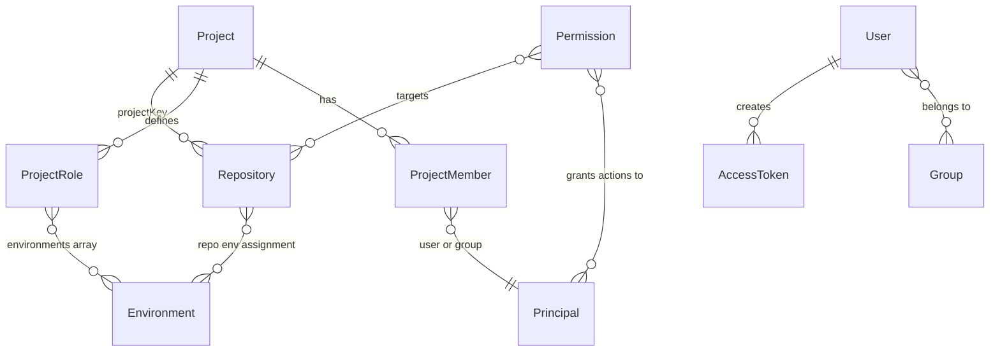

# Platform / Access entities

When to read this file:

- Explaining how **Projects**, **repositories**, **members**, **roles**, and
  **environments** fit together.
- Working with **users**, **groups**, or **access tokens** at the platform level.
- Building **inventories or reports** that join Artifactory data with
  Access / Projects.
- Avoiding two common mistakes: inferring project membership from
  **repository name**, or assuming **roles** are identical across projects.

For endpoint-level curl examples, see `projects-api.md`. For list-vs-detail
API patterns and batching, see `general-bulk-operations-and-agent-patterns.md`.

## Entity relationship overview

## Project

Organizational container for grouping members, roles, and resources.

| Field | Description |
|-------|-------------|
| `project_key` | Unique identifier (short string, used in APIs and repo assignment) |
| `display_name` | Human-readable name |
| `description` | Project description |
| `admin_privileges` | Flags controlling project-level admin behavior |
| `storage_quota` | Storage limits for the project |

A project hosts **members** (users and groups with roles) and **resources**
(repositories, builds, Release Bundles) assigned to it.

API: `GET /access/api/v1/projects`, `GET /access/api/v1/projects/<project-key>`.

Documentation: [Get Started with Projects](https://docs.jfrog.com/projects/docs),
[Basic Projects Terminology](https://docs.jfrog.com/projects/docs/basic-projects-terminology).

## Project role

Per-project role definition that scopes what members may do.

| Field | Description |
|-------|-------------|
| `name` | Role name (e.g. `Developer`, `Release Manager`) |
| `type` | `PREDEFINED` or `CUSTOM` |
| `environments` | List of environments where the role applies (e.g. `["DEV", "PROD"]`) |
| `actions` | Permitted actions within those environments |

Predefined role templates exist, but projects can define **custom roles**.
Two projects may have different custom roles or different definitions for
roles with the same name — always fetch per project when reporting.

API: `GET /access/api/v1/projects/<project-key>/roles`.

## Project member

A user or group assigned a role within a project.

| Field | Description |
|-------|-------------|
| `name` | Username or group name |
| `roles` | List of role names assigned in this project |

Membership is **not** the same as global platform administration. Roles are
evaluated in a project context — a user can be a Developer in one project
and a Release Manager in another.

API: `GET /access/api/v1/projects/<project-key>/users`,
`GET /access/api/v1/projects/<project-key>/groups`.

## Environment

Environments group resources and scope RBAC so that roles can have different
permissions per environment (e.g. separate DEV vs PROD behavior).

| Field | Description |
|-------|-------------|
| `name` | Environment name (e.g. `DEV`, `STAGING`, `PROD`) |

Environments can be defined at **global** scope (available across projects) or
**project** scope. Repositories can be assigned to one or more environments.
Environments are also used in release bundle promotion and application version
promotion (see `release-lifecycle-entities.md` and `apptrust-entities.md`).

API: `GET /access/api/v1/environments`.

Documentation: [Environments](https://docs.jfrog.com/administration/docs/environments).

## User

A platform identity that authenticates and is granted permissions.

| Field | Description |
|-------|-------------|
| `username` | Unique login name |
| `email` | Email address |
| `status` | `enabled` or `disabled` |
| `admin` | Whether the user has platform admin privileges |
| `groups` | Groups the user belongs to |
| `realm` | Authentication realm (e.g. `internal`, `ldap`, `saml`) |

Users can be managed via REST API or synced from external identity providers
(LDAP, SAML, SCIM).

API: `GET /access/api/v2/users/`, `GET /access/api/v2/users/<username>`.

## Group

A named collection of users that simplifies permission management.

| Field | Description |
|-------|-------------|
| `name` | Group name |
| `description` | Group description |
| `auto_join` | Whether new users automatically join this group |
| `admin_privileges` | Whether group members have admin privileges |
| `realm` | Source realm (e.g. `internal`, `ldap`) |
| `external_id` | External identity provider ID (for synced groups) |

Groups can be assigned permissions and project roles, applying them to all
members at once.

API: `GET /access/api/v2/groups/`, `GET /access/api/v2/groups/<group-name>`.

## Access token

A bearer credential with scoped permissions and optional expiry.

| Field | Description |
|-------|-------------|
| `token_id` | Unique token identifier |
| `subject` | The user or service the token represents |
| `scope` | Permission scope (e.g. `applied-permissions/admin`, `applied-permissions/groups:readers`) |
| `expires_in` | TTL in seconds (0 = non-expiring) |
| `refreshable` | Whether the token can be refreshed |
| `description` | Human-readable description |

Tokens are the primary authentication mechanism for API and CLI access.
They can be scoped to specific groups, projects, or admin-level permissions.

CLI: `jf access-token-create [username] [options]`.

API: `POST /access/api/v1/tokens`.

## Repository–Project assignment

A repository is linked to **at most one** project via the `projectKey` field
in its configuration.

| Rule | Detail |
|------|--------|
| **Authoritative field** | `projectKey` on the repository configuration |
| **Not authoritative** | Repository name — a naming pattern like `<project-key>-<suffix>` is a convention, not a guarantee |
| **Unassigned** | Missing or empty `projectKey` means the repo is not tied to any project |

## Agent rules

### 1. Repository to project (authoritative)

1. Obtain repository keys from `GET /api/repositories` (lite list).
2. For each key, call `GET /api/repositories/<repo-key>` and read `projectKey`.
3. Treat missing or empty `projectKey` as **unassigned**, regardless of
   whether the repo name looks like `<project-key>-...`.

Do **not** infer project membership from naming alone. A name-prefix filter is
only a heuristic when detail calls are impossible, and is not authoritative.

Cost: one list plus N detail calls. Batch in one Shell invocation; reuse
captured JSON per SKILL.md "Preserving command output" when iterating with `jq`.

### 2. Project roles (per project)

For each `project_key` in a multi-project report or comparison, call:

`GET /access/api/v1/projects/<project-key>/roles`

Do **not** reuse one project's role payload as representative of all projects.

## Further reading

- [JFrog documentation URLs in this skill](jfrog-url-references.md)
- [Get Started with Projects](https://docs.jfrog.com/projects/docs)
- [Basic Projects Terminology](https://docs.jfrog.com/projects/docs/basic-projects-terminology)
- [Environments (Administration)](https://docs.jfrog.com/administration/docs/environments)
- [Projects API (interactive reference)](https://docs.jfrog.com/projects/reference)
- [Projects API (this skill)](projects-api.md)
