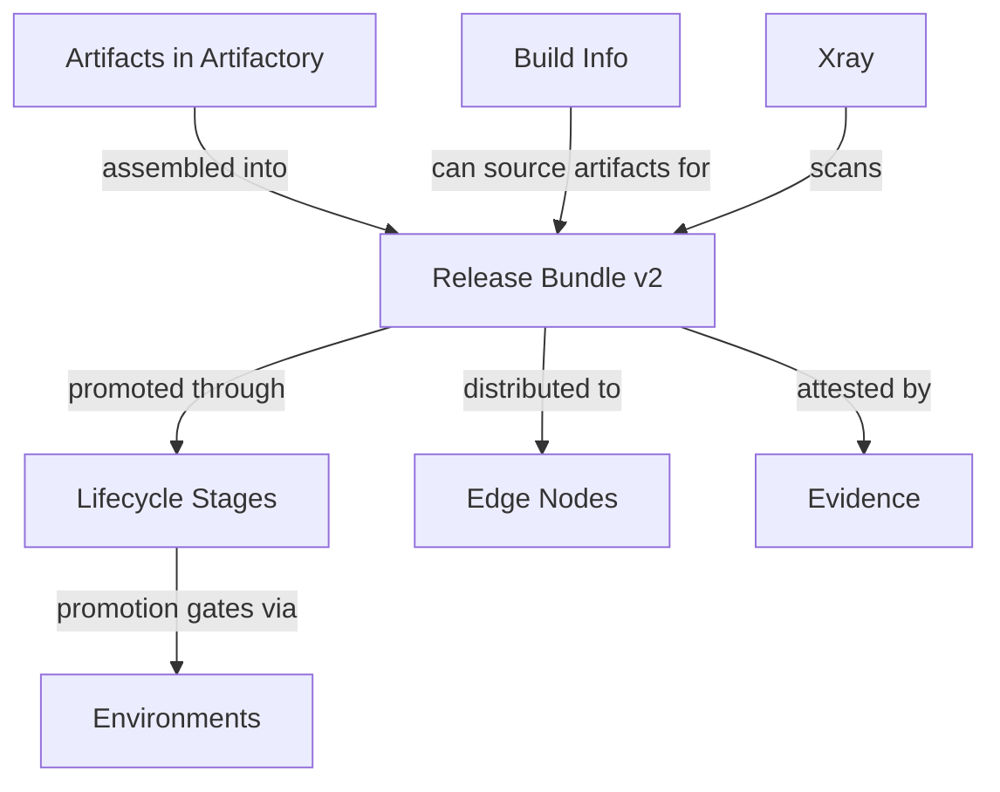

# Release lifecycle entities

When to read this file:

- Working with **release bundles** (create, promote, distribute, delete).
- Understanding the **lifecycle stages** a release bundle passes through.
- Setting up **distribution** to Edge nodes or other Platform Deployments.
- Working with **evidence** (supply chain attestations).
- Mapping CLI commands (`rbc`, `rbp`, `rbd`, etc.) to their lifecycle meaning.

## Entity relationship overview



## Release Bundles (v2)

A release bundle is an **immutable, versioned collection of artifacts**
assembled from Artifactory. It represents a releasable unit that moves through
lifecycle stages toward production.

| Field | Description |
|-------|-------------|
| `name` | Bundle name (e.g. `my-app`) |
| `version` | Semantic or custom version string (e.g. `1.2.0`) |
| `artifacts` | Set of artifacts referenced by repo path and checksum |
| `created` | Timestamp of creation |
| `status` | Current lifecycle status |

Bundles can be assembled from:
- **AQL queries** — dynamically select artifacts matching criteria
- **Build info** — include all artifacts from a published build
- **Explicit list** — specify repo paths directly

Once created, a bundle's artifact list is **immutable** — the same version
always refers to the exact same set of artifacts. This is enforced by
checksums.

> **v1 vs v2:** Release Bundle v1 was managed by the Distribution service and
> is deprecated. Release Bundle v2 is managed by the Lifecycle service and is
> the current model. The CLI `rbc`/`rbp`/`rbd` commands default to v2.

### CLI commands

| Command | Operation | Description |
|---------|-----------|-------------|
| `jf rbc` | Create | Assemble a new release bundle version |
| `jf rbp` | Promote | Move a bundle to the next lifecycle stage |
| `jf rbd` | Distribute | Deliver a bundle to target nodes |
| `jf rbs` | Sign | (v1 only — v2 signs on creation) |
| `jf rbdell` | Delete local | Remove a bundle version locally |
| `jf rbdelr` | Delete remote | Remove a distributed bundle from targets |

## Lifecycle stages

A release bundle progresses through **stages** that typically correspond to
environments (DEV → STAGING → PROD). Each stage transition is a **promotion**.

```
Created ──promote──▶ DEV ──promote──▶ STAGING ──promote──▶ PROD
                                                    │
                                              distribute
                                                    ▼
                                              Edge Nodes
```

Promotion (`jf rbp`):
- Moves the bundle to a target **environment**
- Requires the bundle to have passed any required quality gates (Xray scans, approvals)
- Each promotion is **recorded** with timestamp, user, source and target environment
- Promotions are auditable — the full history is preserved

Environments used in promotion are the same environments configured in the
platform (see `platform-access-entities.md`). They scope which repos are
accessible and which roles apply at each stage.

## Distribution

Distribution delivers a release bundle to **Edge nodes** or other JFrog
Platform Deployments.

| Concept | Description |
|---------|-------------|
| **Distribution target** | A JFrog Edge node or Platform Deployment registered to receive bundles |
| **Distribution rules** | Configuration mapping targets to the bundle version being delivered |
| **Site** | A named destination in the distribution rule |

Distribution (`jf rbd`) copies the bundle's artifacts to the target nodes,
preserving checksums and metadata. The target nodes receive the artifacts in
their local repositories.

Distribution is typically the **final step** after a bundle has been promoted
to a production-ready stage.

## Release Bundles in GraphQL (OneModel)

Release bundle versions are also queryable via the OneModel GraphQL API
which exposes additional relationships not available
through the CLI:

| Field | Description |
|-------|-------------|
| `createdBy`, `createdAt` | Audit fields |
| `artifactsConnection` | Paginated artifacts with path, name, sha256, packageType, packageName, packageVersion, size, properties |
| `evidenceConnection` | Evidence attached to the bundle version |
| `fromBuilds` | Builds that sourced the bundle (name, number, startedAt, repositoryKey) |

Each artifact within a bundle also has its own `evidenceConnection`, allowing
per-artifact attestation queries.

For the OneModel query workflow (credentials, schema fetch, validation,
execution), read `references/onemodel-graphql.md`.

Query: `releaseBundleVersion.getReleaseBundleVersion(name: "...", version: "...", ...)`.

## Evidence

Evidence provides **cryptographic attestations** about artifacts, builds,
release bundles, application versions, and stored packages for supply chain
integrity.

### Evidence entity

| Field | Description |
|-------|-------------|
| `evidenceId` | Unique identifier |
| `subject` | The entity being attested (see Evidence subjects below) |
| `predicateCategory` | Category (e.g. `distribution`) |
| `predicateType` | Full type URI (e.g. `https://jfrog.com/evidence/distribution/v1`) |
| `predicateSlug` | Short form (e.g. `distribution-v1`) |
| `predicate` | Predicate data as JSON |
| `verified` | Whether the evidence signature has been verified |
| `signingKey` | Signing key with `alias` and `publicKey` for DSSE verification |
| `providerId` | ID of the evidence provider |
| `stageName` | Stage in which evidence was created (for release bundles and app versions) |
| `createdBy`, `createdAt` | Audit fields |
| `attachments` | File attachments (e.g. legal documents) with name, sha256, type, downloadPath |

Evidence records create a verifiable chain of trust:
- Build systems attest to build provenance
- Test frameworks attest to test results
- Approvers attest to manual reviews
- Security scans attest to vulnerability status
- Distribution records attest to delivery

### Evidence subjects

Evidence subjects are **cross-domain** — the `EvidenceSubject` type is shared
across multiple domains via the `fullPath` key:

| Subject type | Domain | Example |
|-------------|--------|---------|
| Release bundle version | Release Lifecycle | Bundle attestation before distribution |
| Release bundle artifact | Release Lifecycle | Per-artifact attestation within a bundle |
| Application version | AppTrust | App version attestation before promotion |
| Application version artifact | AppTrust | Per-artifact attestation within an app version |
| Stored package version location | Stored Packages | Package attestation at a specific repo location |

This means evidence can be queried from any of these entry points — you don't
need to start from the Evidence query root. For example,
`applications.getApplicationVersion(...).evidenceSubject` reaches the same
evidence as `evidence.searchEvidence(where: {...})`.

### CLI and GraphQL access

- **CLI**: `jf evd` namespace. Use `jf evd --help` for available commands.
- **GraphQL**: `evidence.searchEvidence(where: {...})`,
  `evidence.getEvidenceById(id: "...")`, or
  `evidence.getEvidence(repositoryKey: "...", path: "...", name: "...")`.

Evidence can be queried to verify that all required attestations exist before
promotion or distribution.
