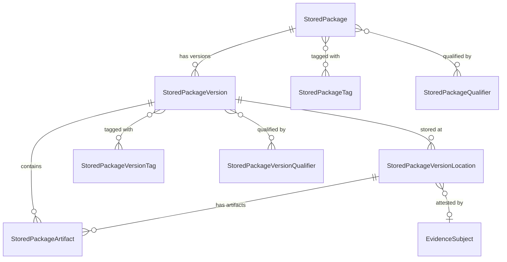

# Stored Packages entities (Metadata)

When to read this file:

- Querying **packages stored in Artifactory** at the package level (not raw artifacts).
- Finding **where a package version lives** (which repository, which path).
- Looking up **download statistics**, **tags**, or **qualifiers** on packages.
- Using the OneModel GraphQL API with the `storedPackages` query root.
- Understanding how the **Metadata layer bridges** Artifactory storage with
  Applications and Catalog.

Stored Packages entities are accessed via the **OneModel GraphQL API**
(`/onemodel/api/v1/graphql`).

For the OneModel query workflow (credentials, schema fetch, validation,
execution), read `references/onemodel-graphql.md`.

## Entity relationship overview

## StoredPackage

A software package as known to Artifactory's metadata layer. This is the
**package-centric abstraction** over raw artifact storage — it groups related
artifacts into named, typed, versioned packages.

| Field | Description |
|-------|-------------|
| `name` | Package name (e.g. `lodash`, `spring-boot-starter-web`) |
| `type` | Package type (`npm`, `maven`, `docker`, `pypi`, etc.) |
| `repositoryPackageType` | Canonicalized Artifactory repo type enum (see below) |
| `description` | Package description |
| `versionsCount` | Number of known versions |
| `latestVersionName` | Most recent version string |
| `respectsSemver` | Whether versions follow semver |
| `tags` | Package-level tags |
| `qualifiers` | Key-value qualifiers |
| `stats` | Download count |
| `createdAt`, `modifiedAt` | Timestamps |

Query: `storedPackages.getPackage(name: "...", type: "...")` or
`storedPackages.searchPackages(where: {...})`.

### Repository package type mapping

The `repositoryPackageType` enum canonicalizes Artifactory repo types. Notable
aliases:

| Artifactory type | Enum value |
|------------------|------------|
| `golang` | `GO` |
| `rpm` | `YUM` |
| `rubygems` | `GEMS` |
| `deb`, `dsc` | `DEBIAN` |
| `terraformprovider`, `terraformmodule` | `TERRAFORM` |
| `hfdataset` | `HUGGINGFACEML` |

The full enum includes 40+ types. Use `repositoryPackageType` for filtering
when the Artifactory repo type name differs from the canonical form.

## StoredPackageVersion

A specific version of a package, with location and artifact details.

| Field | Description |
|-------|-------------|
| `package` | Parent StoredPackage |
| `version` | Version string |
| `versionSize` | Total size in bytes |
| `tags` | Version-level tags |
| `qualifiers` | Version-level key-value qualifiers |
| `stats` | Download count |
| `createdAt`, `modifiedAt` | Timestamps |

Connections:
- `locationsConnection` — where this version is stored (repos + paths)
- `artifactsConnection` — binary artifacts in this version

Query: `storedPackages.searchPackageVersions(where: {...})`.

### Filtering capabilities

StoredPackageVersion supports rich filtering:
- By version string (exact, prefix, contains)
- By project key
- By creation/modification date ranges
- By version size
- By associated tags, qualifiers, locations, artifacts, licenses
- `ignorePreRelease` flag to exclude pre-release versions

## StoredPackageVersionLocation

The **bridge entity** connecting a package version to a physical repository
location in Artifactory. This is the key entity for answering "where does
package X version Y live?"

| Field | Description |
|-------|-------------|
| `repositoryKey` | Artifactory repository key |
| `repositoryType` | Repository class |
| `packageVersion` | Parent version |
| `leadArtifactPath` | Path of the primary artifact |
| `leadArtifactSha256` | Checksum of the primary artifact |
| `evidenceSubject` | Evidence attestation anchor (shared across domains) |
| `stats` | Location-specific download count and last-downloaded timestamps |

The `evidenceSubject` field connects to the Evidence domain — evidence can be
attached to a specific package version in a specific repo, not just to the
version globally.

The `stats` block includes `downloadCount`, `lastDownloadedAt`, and
`remoteLastDownloadedAt` — the last field tracks when the artifact was last
fetched from a remote repository source.

## StoredPackageArtifact

An individual binary file within a package version.

| Field | Description |
|-------|-------------|
| `name` | File name |
| `sha256` | SHA-256 checksum (primary identifier) |
| `sha1`, `md5` | Additional checksums |
| `size` | Size in bytes |
| `mimeType` | Content type |
| `qualifiers` | Artifact-level key-value qualifiers |

Filtering supports `isLeadArtifact` to identify the primary artifact in a
package version, and `projectKey` for project-scoped queries.

## Cross-domain connections

Stored Packages bridge Artifactory storage to higher-level domains:

- **Applications (AppTrust)** — `ApplicationVersionReleasable.packageVersionLocation`
  links to `StoredPackageVersionLocation`. Applications reference where their
  package releasables physically reside.
- **Evidence** — `StoredPackageVersionLocation.evidenceSubject` connects to
  the Evidence domain via `EvidenceSubject.fullPath`. Evidence can attest to
  a specific package version at a specific repository location.
- **Catalog** — Stored Packages represent what's *in your Artifactory*, while
  the Catalog represents the global knowledge base *about* those packages.
  The package `type` + `name` can join across both.

## Stored Packages vs. raw Artifactory

| Aspect | Stored Packages | Artifactory (REST/CLI) |
|--------|------------------------|------------------------|
| **Abstraction** | Package-centric (name + type + version) | File-centric (repo + path + name) |
| **Access** | GraphQL only | REST + CLI (`jf rt`) |
| **Versioning** | Built-in version model | Directory conventions per package type |
| **Locations** | Explicit location entity per version | Implicit via file path |
| **Use case** | Package inventory, cross-repo queries, application binding | File operations, repo management, builds |
