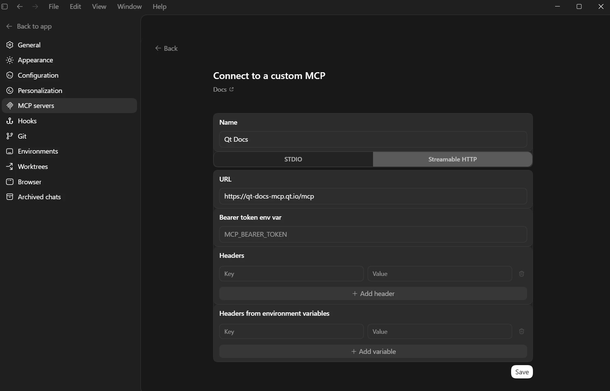

# Manual client setup

Direct configuration for clients that aren't using the
`qt-development-skills` claude plugin. The endpoint in every case is:

```
https://qt-docs-mcp.qt.io/mcp
```

## Claude Code

Register the server globally once by entering this in your terminal:

```shell
claude mcp add --transport http qt-docs https://qt-docs-mcp.qt.io/mcp
```

The server is then available in any Claude Code session.

## Claude Desktop

!!! abstract "Use `mcp-remote` as a bridge (requires Node.js)"
    Claude Desktop only supports stdio transports and cannot connect to
    HTTP MCP servers directly. Use `mcp-remote` as a bridge (requires Node.js).

Open `claude_desktop_config.json`:

- **macOS**: `~/Library/Application Support/Claude/claude_desktop_config.json`
- **Windows**: `%APPDATA%\Claude\claude_desktop_config.json`

```json
{
  "mcpServers": {
    "qt-docs": {
      "command": "npx",
      "args": ["mcp-remote", "https://qt-docs-mcp.qt.io/mcp"]
    }
  }
}
```

Restart Claude Desktop after editing. On first use you may be prompted
to install `mcp-remote` — confirm to proceed.

## OpenAI Codex

1. Go to: **Settings → MCP server → Add Server**.
2. Select **Streamable HTTP**.
3. Paste the URL:

```
https://qt-docs-mcp.qt.io/mcp
```
4. Give it a name and save.



## Google Antigravity

In **Agent Settings**, add a server entry pointing at the URL:

```json
{
  "mcpServers": {
    "qt-docs": {
      "serverUrl": "https://qt-docs-mcp.qt.io/mcp",
      "headers": {
        "Content-Type": "application/json"
      }
    }
  }
}
```
